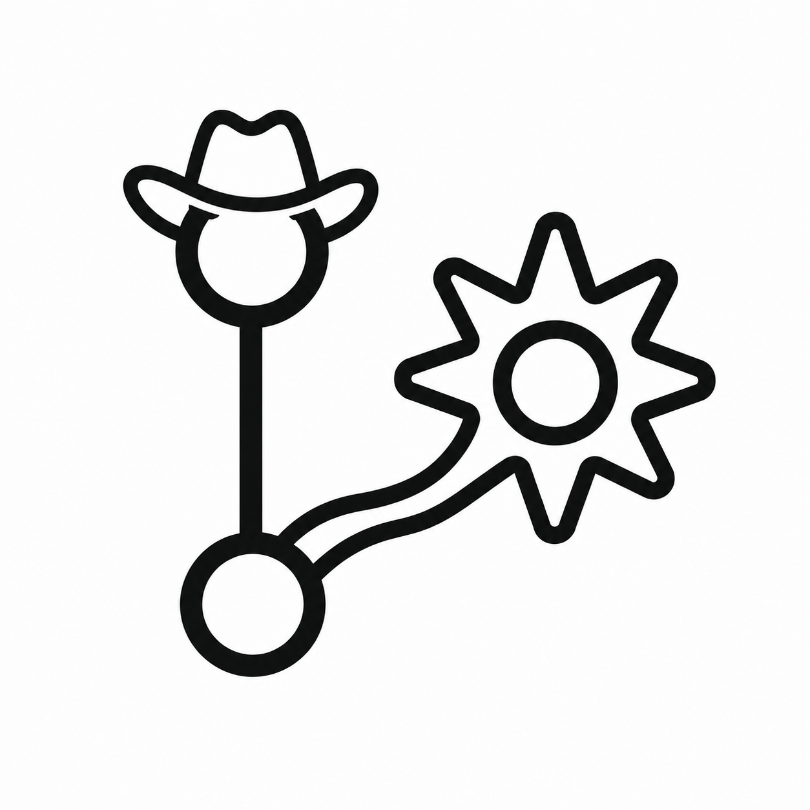

# Spurstack

<p align="center">
  
</p>

Spurstack is a self-hosted stack of autonomous coding agents. Each issue runner is a **spur**: a small agent process that nudges a repository from a GitHub issue toward a pull request.

Spurstack polls GitHub every 60 seconds and starts one spur for each open issue labeled `agent-ready` whose issue author is trusted.

For each matching issue, Spurstack:

1. Verifies the issue author is trusted to trigger a run.
2. Claims the issue by adding `agent-running` and removing `agent-ready`.
3. Skips issues that also have `agent-running` or `agent-pr-opened`.
4. Clones or updates the repository cache using plain remote URLs and non-persistent GitHub token authentication.
5. Creates a dedicated git worktree and branch.
6. Asks an OpenAI-compatible model for an implementation plan.
7. Lets the spur read/edit/write files in the worktree.
8. Allows the spur to create Conventional Commits as it completes coherent chunks of work.
9. Commits any remaining uncommitted changes with a Conventional Commit message.
10. Optionally runs a **wrangler** review cycle when `WRANGLER_MODEL` is configured.
11. Pushes the branch and opens a GitHub pull request.
12. Adds a `## Closes #<issue>` footer, wrangler comments when available, and the unique spur run ID to the PR body.
13. Replaces `agent-running` with `agent-pr-opened` on success, or `agent-failed` on failure.

The default LLM target is OpenRouter, but any OpenAI-compatible chat completions endpoint can be used. No inbound internet access is required; Spurstack only makes outbound HTTPS calls to GitHub and the model provider.

For OpenRouter, you can force provider routing. For example, to use DeepInfra only:

```bash
OPENROUTER_PROVIDER_ORDER=DeepInfra
OPENROUTER_ALLOW_FALLBACKS=false
```

## Configuration

Environment variables:

| Variable | Required | Default | Description |
| --- | --- | --- | --- |
| `GITHUB_TOKEN` | yes | | Token with repo contents, issues, labels, and pull request permissions. |
| `GITHUB_REPOSITORIES` | yes | | Comma-separated repos to poll, e.g. `owner/repo,owner/other-repo`. |
| `OPENAI_API_KEY` | yes | | OpenRouter/OpenAI-compatible API key. |
| `OPENAI_BASE_URL` | no | `https://openrouter.ai/api/v1` | OpenAI-compatible API base URL. |
| `SPUR_MODEL` | no | `anthropic/claude-sonnet-4.6` | Model used by the implementation spur. |
| `WRANGLER_MODEL` | no | | Optional model used to review spur changes before PR creation. If unset, no wrangler cycle runs. |
| `MAX_WRANGLER_CYCLES` | no | `3` | Failed wrangler passes allowed before opening the PR anyway. Ignored when `WRANGLER_MODEL` is unset. |
| `OPENROUTER_PROVIDER_ORDER` | no | | Comma-separated OpenRouter provider preference, e.g. `DeepInfra`. |
| `OPENROUTER_ALLOW_FALLBACKS` | no | `true` | Whether OpenRouter may fall back to other providers when `OPENROUTER_PROVIDER_ORDER` is set. |
| `WORKSPACE_DIR` | no | `/var/lib/spurstack/workspace` | Persistent clone/worktree storage. |
| `POLL_INTERVAL` | no | `60s` | GitHub polling interval. |
| `SPUR_LABEL` | no | `agent-ready` | Issue label that triggers spurs. |
| `MAX_SPUR_STEPS` | no | `30` | Max model/tool iterations per spur run. |
| `GIT_AUTHOR_NAME` | no | `Spurstack` | Commit author name. |
| `GIT_AUTHOR_EMAIL` | no | `spurstack@example.local` | Commit author email. |
| `TRUSTED_AUTHOR_ASSOCIATIONS` | no | `OWNER,MEMBER,COLLABORATOR` | Comma-separated GitHub issue `author_association` values allowed to trigger runs. |

## GitHub setup

No webhook is needed.

## Git credential safety

Spurstack uses `GITHUB_TOKEN` for GitHub API requests and for authenticated `git clone`, `git fetch`, and `git push` operations. Git remotes are always stored as plain URLs such as `https://github.com/owner/repo.git`; the token is provided to Git out-of-band for each command and is not written to `remote.origin.url`.

On startup of a repository run, Spurstack also checks existing cached clones under `WORKSPACE_DIR/repos`. If a previous version stored an `https://x-access-token:<token>@...` origin URL, Spurstack rewrites that remote to the plain GitHub URL before fetching or pushing. Git command errors redact tokenized URLs before they are returned to logs.

Operators should still treat `GITHUB_TOKEN` as sensitive process configuration: keep `.env` files private, avoid enabling Git trace/debug environment variables in production, and rotate any token that may have been persisted by older Spurstack versions.

Spurstack automatically creates these labels in each watched repo if they do not already exist:

```text
agent-ready
agent-running
agent-pr-opened
agent-failed
```

To trigger Spurstack, add `agent-ready` to an open issue in a repo listed in `GITHUB_REPOSITORIES`.

By default, only issues authored by GitHub users whose `author_association` is `OWNER`, `MEMBER`, or `COLLABORATOR` may trigger a spur. Issues from untrusted authors are not claimed as running and no job starts. Spurstack leaves a short issue comment explaining the skip and removes the trigger label to avoid repeated attempts.

Spurstack is a polling service and currently authorizes the issue author, not the user who applied `agent-ready`. If a trusted collaborator wants to run Spurstack on an untrusted reporter's request, they should open a trusted follow-up issue or adjust `TRUSTED_AUTHOR_ASSOCIATIONS` intentionally.

Agent labels act as a simple state machine:

```text
agent-ready -> agent-running -> agent-failed
                            \-> agent-pr-opened
```

Issues with `agent-running` or `agent-pr-opened` are skipped even if `agent-ready` is also present. To retry a failed issue, add `agent-ready`; Spurstack will remove `agent-failed` when it claims the retry.

## Run locally

```bash
export GITHUB_TOKEN=...
export GITHUB_REPOSITORIES=owner/repo
export OPENAI_API_KEY=...
go run ./cmd/spurstack
```

## Docker Compose

```bash
cp .env.example .env
# edit .env with real secrets
docker compose up --build
```

## Container

```bash
docker build -t spurstack .
docker run --rm \
  -e GITHUB_TOKEN=... \
  -e GITHUB_REPOSITORIES=owner/repo \
  -e OPENAI_API_KEY=... \
  -v spurstack-workspace:/var/lib/spurstack/workspace \
  spurstack
```

## Spur tools

During implementation, a spur can request these app-owned actions:

- `read`: read a relative path inside the worktree.
- `write`: create or fully rewrite a relative path.
- `edit`: replace exactly one matching text block in an existing file.
- `commit`: commit all current file changes with a Conventional Commit message.
- `finish`: return final PR metadata; Spurstack commits any remaining changes, pushes, and opens the PR.

Spurs cannot run arbitrary shell commands, push branches, or mutate GitHub issues/PRs directly.

### Protected paths

Spurstack treats high-risk execution and configuration surfaces as **protected paths**. These files remain readable for context, but spur `write` and `edit` actions fail with a clear protected-path error, and Spurstack refuses to commit or push a run while protected-path changes are present.

The default protected set is intentionally simple and hard-denied: `.github/`, `.git/`, CI directories/configs, Dockerfile/Containerfile variants, Compose files, package manager manifests and lockfiles, build files, Makefiles, and top-level script/CI directories. This reduces prompt-injection blast radius by preventing an issue body or wrangler feedback from silently changing workflows, dependency hooks, container builds, or other surfaces that could execute with repository or CI privileges.

Legitimate changes to these paths should be made by a human outside Spurstack and reviewed through the normal repository process.

## Wranglers

A **wrangler** is an optional reviewing model. Configure `WRANGLER_MODEL` to have Spurstack review the current diff after the spur calls `finish` and before the PR is opened.

If the wrangler finds issues, its comments are sent back to the spur and the spur resumes its work loop. If `MAX_WRANGLER_CYCLES` is exceeded, Spurstack still opens the PR and adds the latest concerns for human review.

PRs reviewed by a wrangler include this section after the spur-provided PR body:

```md
## Wrangler Comments (<model-name>)
```

When max wrangler cycles are exceeded, that section starts with:

```md
**NOTE: Max Wrangler Cycles Exceeded. Concerns Listed Below**
```

When `WRANGLER_MODEL` is unset, Spurstack skips the wrangler cycle and omits the wrangler comments section.

## Logs and run IDs

Each spur run gets an ID like `run-1a2b3c4d5e6f7890`. The ID is logged as `run_id=...` and appended to the PR body:

```text
Spur run ID: `run-1a2b3c4d5e6f7890`
```

Find logs for a run with:

```bash
docker compose logs spurstack | grep run-1a2b3c4d5e6f7890
```

## Notes

- Runs are serialized per GitHub issue inside one Spurstack instance.
- GitHub labels are the durable run state across restarts.
- Successful runs clean up their worktree after opening a PR.
- Failed runs keep their worktree for inspection until the same issue is retried.
